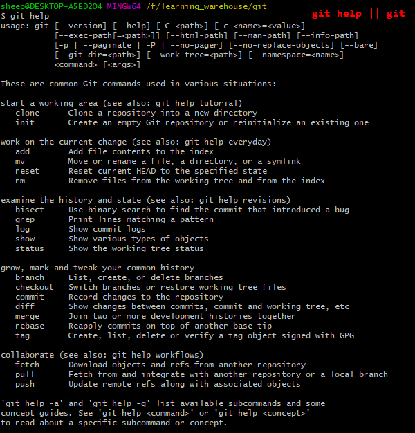
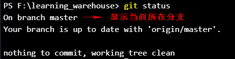
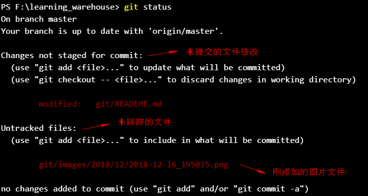
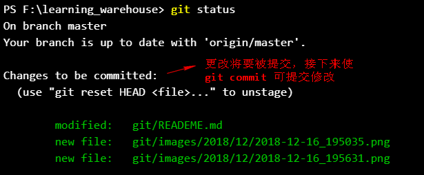
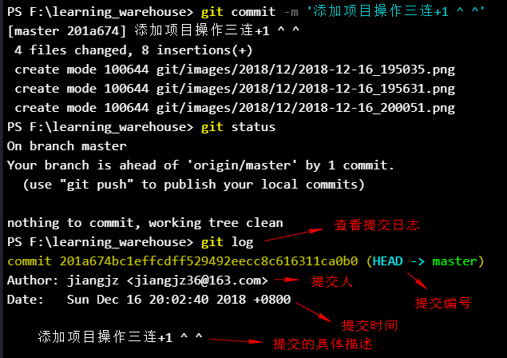
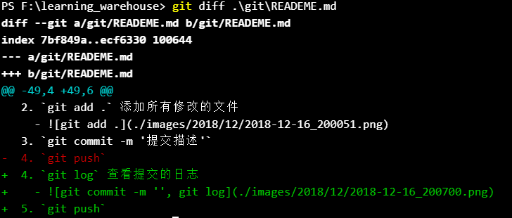
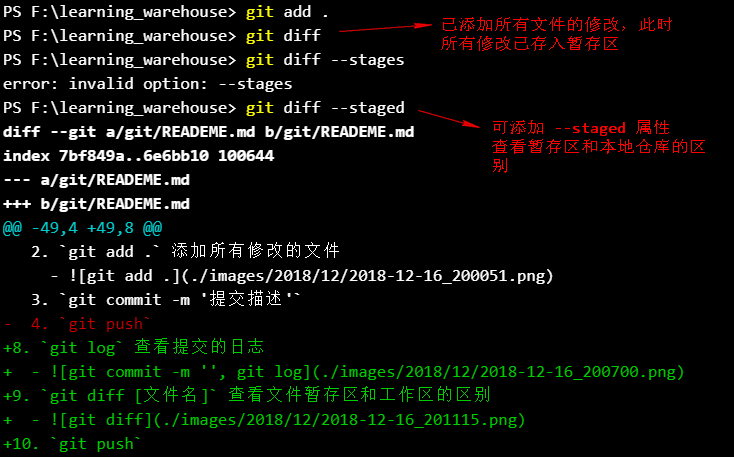
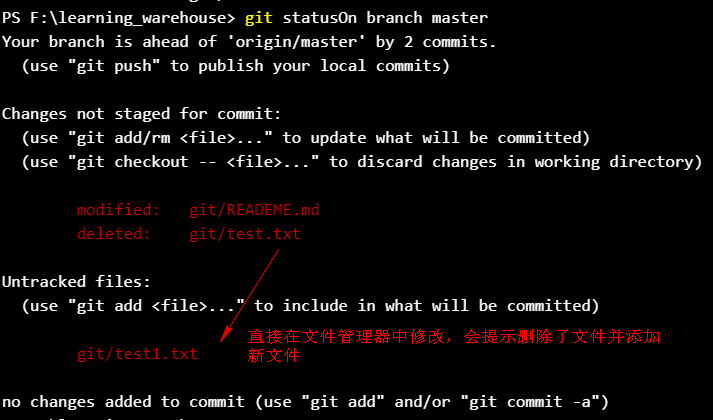
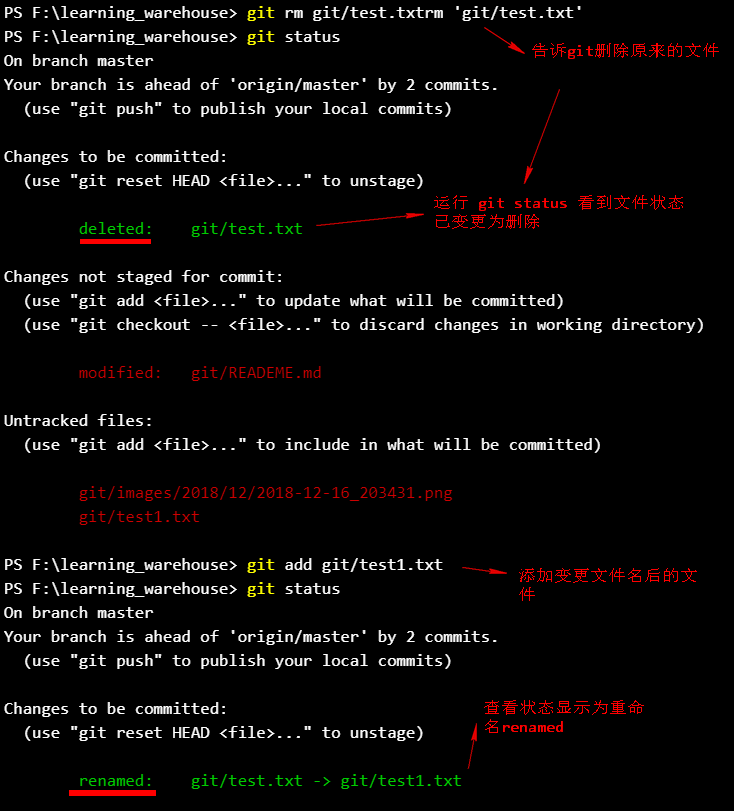
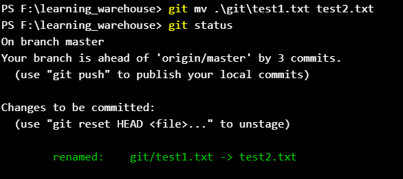

# 该项目主要用于记录git的相关知识点
> 内容来源宁浩网的git课程

## 查看帮助信息
1. `git help` 显示常用的git命令，或者简短的解释
  - `git help -a` 查看所有命令
  - `git help -g` 查看使用手册
  - 
2. git 初始化设定的范围
  - system 所有登录该系统的用户都遵循这个设置
  - global 当前用户的全局设定，不同的用户设定不同的设置
  - project 项目范围内设定
3. git 命令的组成
  - name 指令名称, 比如`config`、`add`
  - options 选项, 比如`--global`、`--list`
  - type 设定的参数, 比如 `user.name`
  - value 设定的值, 比如 `jiangjz`
4. git 设定参数，以global为例
  - `git config --global user.name 'jiangjz'`
    - `config` 配置指令
    - `--gloabl` 设定范围为当前用户
    - `user.name` 设置用户名
  - `git config --list` 查看配置信息
    - `--list` 显示配置列表选项
  - `git config --unset --global user.name` 重置配置信息
    - `--unset` 重置配置选项
    - `--gloabl` 重置的范围
  - `git config --global user.email 'jiangjz36@163.com'`
  - `git config --global color.ui true` git 定义输出的文字带颜色
  - `cat ~/.gitconfig` 查看全局配置的存放地址
  - `git config --global alias.co checkout` 在全局范围内定义别名
    - alias 定义别名指令
    - .co 表示用户自定义的别名
    - checkout 表示原指令
    - `cat ~/.gitconfig` 配置会放在主目录下的文件中
    - `vim ~/.bash_profile` 也可以通过文件批量配置别名
5. 设置需要忽略的文件
  - `git config --global core.excludesfile ~/.gitignore_global` 定义在全局范围内忽略的配置文件位置
    - `core.excludesfile` 配置忽略文件的位置
    - `vim ~/.gitignore_global` 编辑该配置文件并在其中写入
      - `.DS_Store` 配置忽略os的文件
    - `touch .DS_Store` 可以手动创建文件，并测试配置是否生效
    - __git无法忽略已跟踪的文件,可以使用git rm等指令修改__
6. `git init`初始化项目
7. 项目操作三连+1
  1. `git status`
    - 
    - 
  2. `git add .` 添加所有修改的文件
    - 
  3. `git commit -m '提交描述'`
8. `git log` 查看提交的日志
  - 
9. `git diff [文件名]` 查看文件暂存区和工作目录的区别
  - `git diff --staged` 查看文件暂存区和仓库的区别
  - 
  - 
10. 重命名git已经跟踪的文件
  1. 方法1：通过文件管理器修改文件
    1. 
      1. `git rm test.txt` 告诉git要删除文件
      2. `git add test1.txt`
      3. 
  2. 方法2：使用`git mv 要修改的文件 新的文件名`
    1. `git mv git/test1.txt test2.txt`
      1. 
11. `git mv` 移动文件
  1. git不会跟踪空文件夹
